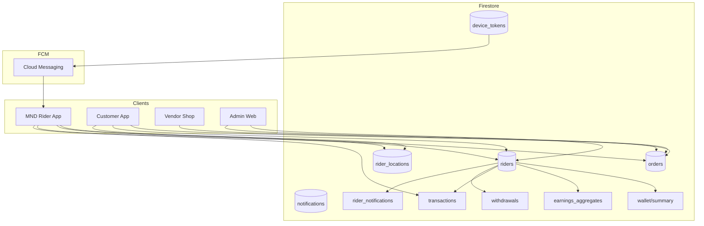
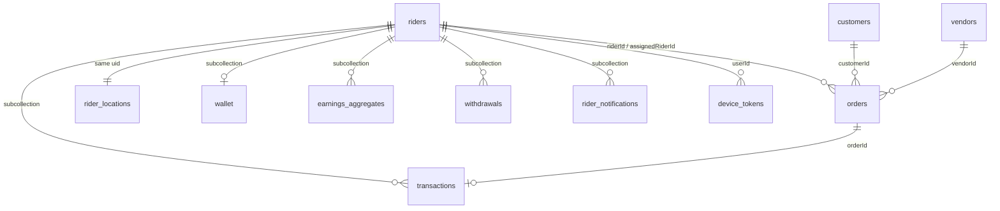

# MND Rider App — Firestore Database Schema

**Project:** `mnd-masterndelivery` (shared with Customer, Vendor/Shop, Admin)  
**SDK:** Flutter `mnd_rider` + `cloud_firestore`  
**Rules file:** `mnd_customer/firestore.rules`

This schema is optimized for **realtime rider operations**: job pool, active trips, live GPS, earnings ledger, and push notifications.

---

## Architecture overview



**Design principles**

| Principle | Application |
|-----------|-------------|
| Denormalize for reads | `storeName`, `deliveryFee`, coords on `orders` |
| Scope by rider | `riderId`, `assignedRiderId` on orders; earnings under `riders/{uid}` |
| Idempotent writes | `transactions/earning_{orderId}` prevents double credit |
| Hot path separation | GPS → `rider_locations/{uid}` (recommended) vs profile `riders/{uid}` |
| Timestamps | `createdAt`, `updatedAt`, status-specific `*At` fields |
| Status enums | String constants (see below) |

---

## Collection map

| Logical area | Physical path | Purpose |
|--------------|---------------|---------|
| **riders** | `riders/{riderId}` | Profile, approval, online, FCM token |
| **orders** | `orders/{orderId}` | Shared order pipeline (customer/vendor/rider) |
| **earnings** | `riders/{riderId}/wallet/summary` | Wallet balances |
| **earnings** | `riders/{riderId}/earnings_aggregates/{periodKey}` | Daily/weekly/monthly rollups |
| **transactions** | `riders/{riderId}/transactions/{transactionId}` | Ledger |
| **earnings** | `riders/{riderId}/withdrawals/{withdrawalId}` | Payout requests |
| **notifications** | `notifications/{id}` | Customer/vendor alerts (existing) |
| **notifications** | `riders/{riderId}/notifications/{id}` | Rider inbox (recommended) |
| **rider_locations** | `rider_locations/{riderId}` | Latest GPS (recommended split) |
| **device_tokens** | `device_tokens/{tokenHash}` | FCM token registry |
| **system** | `system/order_sequence` | Order tracking numbers |

> **Note:** The rider app already embeds live GPS on `riders/{uid}` (`currentLocation`, `latitude`, `longitude`). For production scale, mirror updates to `rider_locations/{uid}` and keep `riders` for profile reads only.

---

## 1. `riders/{riderId}`

**Document ID:** Firebase Auth `uid`

### Fields

| Field | Type | Required | Description |
|-------|------|----------|-------------|
| `uid` | string | ✓ | Same as document ID |
| `fullName` | string | ✓ | Display name |
| `phone` | string | ✓ | E.164 (`+94771234567`) |
| `email` | string | | Legacy synthetic auth email (no longer written on register) |
| `nicNumber` | string | ✓ | National ID |
| `profilePhotoUrl` | string | | Storage URL |
| `licensePhotoUrl` | string | | Driving license Storage URL |
| `vehiclePhotoUrl` | string | | Vehicle photo Storage URL |
| `insurancePhotoUrl` | string | | Insurance document Storage URL |
| `insuranceExpiresAt` | timestamp | | Insurance expiry (date) |
| `revenueLicensePhotoUrl` | string | | Revenue license Storage URL |
| `revenueLicenseExpiresAt` | timestamp | | Revenue license expiry (date) |
| `vehicleType` | string | ✓ | `bike` \| `three_wheeler` \| `car` \| `van` |
| `vehicleNumber` | string | ✓ | Plate / reg |
| `city` | string | ✓ | Operating city |
| `role` | string | ✓ | `rider` |
| `status` | string | ✓ | `pending` \| `approved` \| `active` \| `rejected` |
| `online` | boolean | ✓ | Accepting jobs |
| `registrationComplete` | boolean | ✓ | Onboarding done |
| `fcmToken` | string | | Latest FCM token |
| `fcmTokenUpdatedAt` | timestamp | | Token sync time |
| `currentLocation` | geopoint | | **Legacy/hot** latest position |
| `latitude` | number | | Denormalized lat |
| `longitude` | number | | Denormalized lng |
| `heading` | number | | Degrees |
| `speed` | number | | m/s |
| `locationUpdatedAt` | timestamp | | Last GPS write |
| `createdAt` | timestamp | ✓ | |
| `updatedAt` | timestamp | ✓ | |

### Rider `status` (admin-controlled)

| Value | Meaning |
|-------|---------|
| `pending` | Registered, awaiting approval |
| `approved` | Can go online and claim orders |
| `active` | Same as approved (alias) |
| `rejected` | Blocked |

### Example document

```json
{
  "uid": "RIDER_UID_abc123",
  "fullName": "Kamal Perera",
  "phone": "+94771234567",
  "nicNumber": "199512345V",
  "profilePhotoUrl": "https://storage.googleapis.com/.../profile.jpg",
  "licensePhotoUrl": "https://storage.googleapis.com/.../license.jpg",
  "vehiclePhotoUrl": "https://storage.googleapis.com/.../vehicle.jpg",
  "insurancePhotoUrl": "https://storage.googleapis.com/.../insurance.jpg",
  "insuranceExpiresAt": "2027-03-15T00:00:00.000Z",
  "revenueLicensePhotoUrl": "https://storage.googleapis.com/.../revenue_license.jpg",
  "revenueLicenseExpiresAt": "2026-12-31T00:00:00.000Z",
  "vehicleType": "bike",
  "vehicleNumber": "ABC-1234",
  "city": "Colombo",
  "role": "rider",
  "status": "approved",
  "online": true,
  "registrationComplete": true,
  "fcmToken": "dXyz...",
  "fcmTokenUpdatedAt": "2026-05-17T10:00:00Z",
  "latitude": 6.9271,
  "longitude": 79.8612,
  "heading": 180,
  "speed": 8.5,
  "locationUpdatedAt": "2026-05-17T10:05:00Z",
  "createdAt": "2026-05-01T08:00:00Z",
  "updatedAt": "2026-05-17T10:05:00Z"
}
```

### Subcollections

#### `riders/{riderId}/wallet/summary`

| Field | Type | Description |
|-------|------|-------------|
| `balanceLkr` | number | Available balance |
| `pendingWithdrawalLkr` | number | Locked in pending payouts |
| `lifetimeEarnedLkr` | number | All-time earned |
| `lifetimeWithdrawnLkr` | number | All-time paid out |
| `updatedAt` | timestamp | |

```json
{
  "balanceLkr": 12500,
  "pendingWithdrawalLkr": 2000,
  "lifetimeEarnedLkr": 85000,
  "lifetimeWithdrawnLkr": 70500,
  "updatedAt": "2026-05-17T09:00:00Z"
}
```

#### `riders/{riderId}/earnings_aggregates/{periodKey}`

**Document ID:** `daily_2026-05-17` \| `weekly_2026-W20` \| `monthly_2026-05`

| Field | Type | Description |
|-------|------|-------------|
| `periodType` | string | `daily` \| `weekly` \| `monthly` |
| `totalLkr` | number | Sum of delivery fees |
| `tripCount` | number | Completed trips in period |
| `updatedAt` | timestamp | |

```json
{
  "periodType": "daily",
  "totalLkr": 3500,
  "tripCount": 7,
  "updatedAt": "2026-05-17T23:59:00Z"
}
```

#### `riders/{riderId}/transactions/{transactionId}`

**Idempotent delivery credit:** `earning_{orderId}`

| Field | Type | Description |
|-------|------|-------------|
| `type` | string | `delivery_earning` \| `withdrawal` \| `adjustment` |
| `status` | string | `completed` \| `pending` \| `failed` \| `cancelled` |
| `amountLkr` | number | Positive credit, negative debit |
| `orderId` | string | Optional link |
| `withdrawalId` | string | Optional link |
| `title` | string | UI title |
| `subtitle` | string | UI subtitle |
| `createdAt` | timestamp | |

```json
{
  "type": "delivery_earning",
  "status": "completed",
  "amountLkr": 450,
  "orderId": "ord_9f2a",
  "title": "Pizza Hut Bambalapitiya",
  "subtitle": "MND260512345",
  "createdAt": "2026-05-17T14:30:00Z"
}
```

#### `riders/{riderId}/withdrawals/{withdrawalId}`

| Field | Type | Description |
|-------|------|-------------|
| `amountLkr` | number | Requested amount |
| `status` | string | `pending` \| `approved` \| `rejected` \| `paid` |
| `payoutMethod` | string | `bank` \| `mobile` |
| `payoutAccount` | string | Account / wallet number |
| `note` | string | Optional |
| `createdAt` | timestamp | |
| `processedAt` | timestamp | Admin action |

---

## 2. `orders/{orderId}`

Shared collection — rider queries drive index design.

### Rider-relevant fields

| Field | Type | Description |
|-------|------|-------------|
| `customerId` | string | Buyer |
| `vendorId` | string | Store ID |
| `storeName` | string | Denormalized |
| `status` | string | Order lifecycle (below) |
| `riderId` | string | Assigned rider (canonical) |
| `assignedRiderId` | string | Same as riderId on claim |
| `openForRiders` | boolean | In job pool |
| `deliveryFee` | int | **Rider payout** (LKR) |
| `total` | int | Order total LKR |
| `items` | array | Line items |
| `deliveryAddress` | map | Dropoff address |
| `pickupLatitude` | number | Vendor |
| `pickupLongitude` | number | Vendor |
| `pickupAddress` | string | Optional |
| `dropoffLatitude` | number | Customer |
| `dropoffLongitude` | number | Customer |
| `trackingNumber` | string | `MND...` |
| `riderAcceptedAt` | timestamp | Claim time |
| `pickedUpAt` | timestamp | |
| `onTheWayAt` | timestamp | |
| `deliveredAt` | timestamp | **Use for earnings period** |
| `cancelledAt` | timestamp | |
| `cancelReason` | string | |
| `riderStatusUpdatedAt` | timestamp | Last rider status change |
| `createdAt` | timestamp | |
| `updatedAt` | timestamp | |

### Order `status` (rider path)

| Status | Rider action |
|--------|----------------|
| `ready` | Visible in pool if `openForRiders == true` |
| `out_for_delivery` | Claimed / en route to vendor |
| `picked_up` | Collected from vendor |
| `on_the_way` | En route to customer |
| `delivered` | Complete → credit earnings |
| `cancelled` | Notify rider |

### Example (open job)

```json
{
  "customerId": "CUST_uid",
  "vendorId": "VENDOR_store_1",
  "storeName": "Burger House",
  "status": "ready",
  "openForRiders": true,
  "deliveryFee": 350,
  "total": 2850,
  "pickupLatitude": 6.9012,
  "pickupLongitude": 79.8523,
  "dropoffLatitude": 6.9156,
  "dropoffLongitude": 79.8721,
  "deliveryAddress": {
    "line1": "12 Galle Road",
    "line2": "Apt 4B",
    "city": "Colombo",
    "phone": "+94771112233"
  },
  "trackingNumber": "MND260500123",
  "createdAt": "2026-05-17T12:00:00Z",
  "updatedAt": "2026-05-17T12:00:00Z"
}
```

### Example (assigned)

```json
{
  "status": "on_the_way",
  "openForRiders": false,
  "riderId": "RIDER_UID_abc123",
  "assignedRiderId": "RIDER_UID_abc123",
  "riderAcceptedAt": "2026-05-17T12:05:00Z",
  "pickedUpAt": "2026-05-17T12:20:00Z",
  "onTheWayAt": "2026-05-17T12:25:00Z",
  "deliveryFee": 350
}
```

---

## 3. `rider_locations/{riderId}` (recommended)

**Document ID:** same as `riderId` (one doc per rider)

High-frequency writes (every ~12–50 m). Separating from `riders/{uid}` avoids invalidating profile listeners on every GPS tick.

| Field | Type | Description |
|-------|------|-------------|
| `riderId` | string | |
| `location` | geopoint | |
| `latitude` | number | |
| `longitude` | number | |
| `heading` | number | |
| `speed` | number | |
| `activeOrderId` | string | Trip context |
| `online` | boolean | |
| `updatedAt` | timestamp | |

```json
{
  "riderId": "RIDER_UID_abc123",
  "location": { "latitude": 6.9271, "longitude": 79.8612 },
  "latitude": 6.9271,
  "longitude": 79.8612,
  "heading": 90,
  "speed": 5.2,
  "activeOrderId": "ord_9f2a",
  "online": true,
  "updatedAt": "2026-05-17T10:05:00Z"
}
```

**Customer app:** subscribe to `rider_locations/{assignedRiderId}` (or `riders/{id}` today).

---

## 4. `notifications/{notificationId}` (global)

Existing — customer/vendor targeted.

| Field | Type | Description |
|-------|------|-------------|
| `userId` | string | Recipient |
| `orderId` | string | |
| `type` | string | e.g. `rider_accepted` |
| `title` | string | |
| `body` | string | |
| `read` | boolean | |
| `createdAt` | timestamp | |

### `riders/{riderId}/notifications/{notificationId}` (recommended)

Rider-specific inbox + FCM sync.

| Field | Type | Description |
|-------|------|-------------|
| `type` | string | `new_delivery_request` \| `order_cancelled` \| `delivery_completed` \| `earnings` |
| `orderId` | string | Optional |
| `title` | string | |
| `body` | string | |
| `read` | boolean | |
| `amountLkr` | number | Earnings pushes |
| `createdAt` | timestamp | |

```json
{
  "type": "new_delivery_request",
  "orderId": "ord_9f2a",
  "title": "New delivery nearby",
  "body": "Burger House · Rs. 350 · 1.2 km",
  "read": false,
  "createdAt": "2026-05-17T12:00:00Z"
}
```

---

## 5. `device_tokens/{tokenId}`

**Document ID:** FCM token with `/` replaced by `_`

| Field | Type | Description |
|-------|------|-------------|
| `userId` | string | Rider uid |
| `token` | string | FCM token |
| `platform` | string | `android` \| `ios` |
| `app` | string | `mnd_rider` |
| `role` | string | `rider` |
| `updatedAt` | timestamp | |

---

## Relationships



---

## Query catalog (MND Rider app)

| Screen / feature | Query | Index required |
|------------------|-------|----------------|
| Job pool | `orders` where `openForRiders==true` AND `status=='ready'` orderBy `createdAt` DESC | ✓ exists |
| My orders | `orders` where `riderId==uid` orderBy `createdAt` DESC | ✓ exists |
| My orders (alt) | `orders` where `assignedRiderId==uid` orderBy `createdAt` DESC | ✓ exists |
| Delivered history | `orders` where `riderId==uid` AND `status=='delivered'` orderBy `createdAt` DESC | ✓ exists |
| Delivered by completion | orderBy `deliveredAt` DESC (recommended) | **add** |
| Order detail | `orders/{orderId}` snapshot | — |
| Wallet | `riders/{uid}/wallet/summary` snapshot | — |
| Transactions | `riders/{uid}/transactions` orderBy `createdAt` DESC | **add** |
| Withdrawals | `riders/{uid}/withdrawals` orderBy `createdAt` DESC | **add** |
| Rider profile | `riders/{uid}` snapshot | — |
| Live map (customer) | `riders/{riderId}` or `rider_locations/{riderId}` | — |
| FCM send (backend) | `riders/{uid}.fcmToken` or `device_tokens` where `userId==uid` | — |

---

## Composite index recommendations

Add to `mnd_customer/firestore.indexes.json`:

```json
{
  "collectionGroup": "orders",
  "queryScope": "COLLECTION",
  "fields": [
    { "fieldPath": "riderId", "order": "ASCENDING" },
    { "fieldPath": "status", "order": "ASCENDING" },
    { "fieldPath": "deliveredAt", "order": "DESCENDING" }
  ]
},
{
  "collectionGroup": "transactions",
  "queryScope": "COLLECTION_GROUP",
  "fields": [
    { "fieldPath": "createdAt", "order": "DESCENDING" }
  ]
},
{
  "collectionGroup": "withdrawals",
  "queryScope": "COLLECTION_GROUP",
  "fields": [
    { "fieldPath": "createdAt", "order": "DESCENDING" }
  ]
},
{
  "collectionGroup": "notifications",
  "queryScope": "COLLECTION_GROUP",
  "fields": [
    { "fieldPath": "read", "order": "ASCENDING" },
    { "fieldPath": "createdAt", "order": "DESCENDING" }
  ]
},
{
  "collectionGroup": "device_tokens",
  "queryScope": "COLLECTION",
  "fields": [
    { "fieldPath": "userId", "order": "ASCENDING" },
    { "fieldPath": "app", "order": "ASCENDING" }
  ]
}
```

---

## Security recommendations

| Collection | Rider read | Rider write |
|------------|------------|-------------|
| `riders/{self}` | ✓ signed-in | ✓ own doc; **cannot** change `status` |
| `riders/{self}/wallet/*` | ✓ | ✓ if approved |
| `riders/{self}/transactions/*` | ✓ | ✓ create only; admin updates |
| `riders/{self}/withdrawals/*` | ✓ | ✓ create `pending` |
| `orders` | ✓ pool + assigned | ✓ claim + status updates if assigned |
| `rider_locations/{self}` | ✓ all signed-in (customer tracks) | ✓ **only** `riderId == auth.uid` |
| `notifications` (global) | ✓ own `userId` | ✗ create via Cloud Function |
| `riders/{self}/notifications` | ✓ | ✓ mark `read` only |
| `device_tokens` | ✓ own | ✓ own `userId` |

**Rules snippets to add (recommended):**

```
match /rider_locations/{riderId} {
  allow read: if isSignedIn();
  allow write: if isSelf(riderId) && riderIsApproved();
}

match /riders/{riderId}/notifications/{notificationId} {
  allow read: if isSelf(riderId);
  allow update: if isSelf(riderId)
    && request.resource.data.diff(resource.data).affectedKeys().hasOnly(['read']);
  allow create, delete: if isAdmin();
}
```

---

## Realtime architecture

| Stream | Listener | Trigger |
|--------|----------|---------|
| Job offers | `watchOpenJobs()` | Vendor sets `ready` + `openForRiders` |
| Assigned list | `watchAssignedToMe()` | Claim transaction |
| Trip screen | `watchOrderDetail(orderId)` | Status patches |
| Wallet / transactions | `watchWallet()`, `watchTransactions()` | Delivery credit |
| Profile | `watchProfile()` | Registration / edit |
| GPS publish | `RiderLocationService` | Timer / position stream |
| Customer tracking | Customer listens `riders` or `rider_locations` | Rider GPS writes |
| Push (background) | FCM + local notification | Cloud Function on order events |

### Cloud Function triggers (backend — recommended)

| Event | Action |
|-------|--------|
| Order → `ready` + `openForRiders` | FCM `new_delivery_request` to topic `mnd_rider_jobs` or nearby riders |
| Order → `cancelled` + has `riderId` | FCM to rider `fcmToken` |
| Order → `delivered` | FCM `delivery_completed`; client credits wallet |
| Transaction `delivery_earning` created | FCM `earnings` with `amountLkr` |

---

## Timestamp conventions

- Use `FieldValue.serverTimestamp()` on all writes.
- Prefer `deliveredAt` (not `createdAt`) for earnings period aggregation.
- Status transitions: set dedicated `*At` fields; do not infer from `updatedAt` alone.

---

## Migration checklist

1. Deploy composite indexes (Firebase Console or `firebase deploy --only firestore:indexes`).
2. Add `rider_locations` + rules; dual-write from `RiderLocationService`.
3. Add `riders/{uid}/notifications` for in-app inbox.
4. Optional: backfill `deliveredAt` on historical `delivered` orders.
5. Cloud Functions: send FCM on order status changes using `data.type` contract (see `FirebaseMessagingService`).

---

*Generated for MND Rider — aligns with `mnd_rider` implementation as of 2026-05.*
